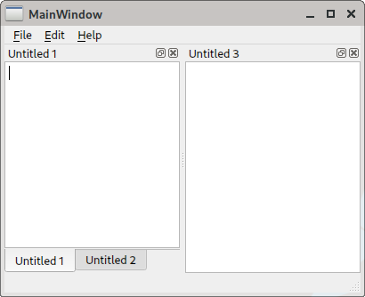
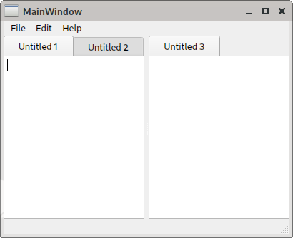

# QMainWindow Tabs

As you might have experienced, QMainWindow behaves quite inconsistently, with dock titles appearing twice when a dock is tabbed and arranging docks by dragging tabs is in vain...

This project demonstrates how the situation can arguably be improved without completely replacing QMainWindow with another implementation.

## Features

- Dock title bars and tabs are combined into one tab bar.
- Tab headers can be dragged to rearrange docks.
- Tab bars can be double clicked to open new tabs.
- The middle mouse button can be used to close tabs.
- When tabs are elided a button appears allowing to select further tabs.
- The selected, all or other tabs can be closed via a context menu.

## Before and after screenshots

 &nbsp;

## Usage

The projects contains two classes [DockWindow](src/DockWindow.h) and [DockTitle](src/DockTitle.h).
Together they form a drop-in-replacement for QMainWindow. So one simply has to derive from DockWindow instead of QMainWindow.

## How does it work

DockWindow derives from QMainWindow and sets a custom dock title bar, which appears and behaves like a QTabBar. Additionally it hides the tab bars potentially created by QMainWindow.
